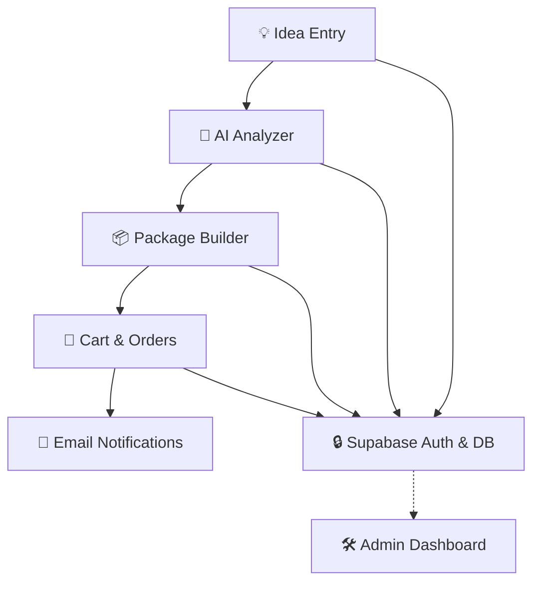
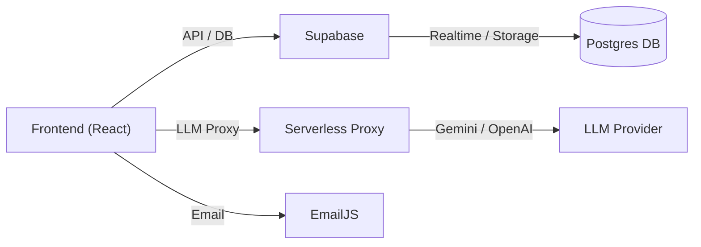

# 🌈 Setu Studios - Build Ideas, Fast & Beautiful

<p align="center">
  <a href="https://setustudios.vercel.app/" target="_blank" rel="noopener noreferrer">
    
  </a>
  <br/>
  
  
  
  
  
</p>

---

## 🎨 What is Setu Studios?

**Setu Studios** is your creative launchpad for turning ideas into reality. Whether you're a founder, maker, or team, Setu Studios helps you brainstorm, analyze, and package new products and services - all in a beautiful, fast, and secure app.

| Benefit                | Description                                                      |
|------------------------|------------------------------------------------------------------|
| 🚀 Instant Ideation    | Capture and refine ideas in seconds                               |
| 🤖 AI Analysis         | Get smart feedback and suggestions                               |
| 📦 Service Packaging   | Bundle offerings, manage carts, and process orders               |
| 🔒 Secure & Private    | Data protected with Supabase RLS                                 |
| ✉️ Notifications       | Stay updated with EmailJS                                        |

---

## 🌟 Why Setu Studios is Useful

| Reason         | How it Helps You                           |
|----------------|--------------------------------------------|
| Speed          | Go from idea to prototype in minutes        |
| Clarity        | AI highlights strengths, gaps, next steps   |
| Collaboration  | Share, edit, and package ideas with team    |
| Automation     | Order flows, notifications, analysis built-in|
| Security       | Sensitive keys and data are protected       |

---

## 🖼️ Flowchart: How It Works



---

## 🏗️ Architecture Diagram



---

## 🔄 Workflow Table

| Step                | Action                                  | Result                        |
|---------------------|-----------------------------------------|-------------------------------|
| 1. Idea Entry       | User submits idea                       | Saved to Supabase DB          |
| 2. AI Analysis      | Idea sent to Gemini/OpenAI via Proxy    | Feedback returned to user     |
| 3. Package Builder  | User bundles services/products          | Cart updated                  |
| 4. Order/Checkout   | User places order                       | Order saved, email sent       |
| 5. Admin Dashboard  | Admin reviews orders/ideas              | Management & analytics        |

---

## 🛠️ Tech Stack

| Layer         | Technology                        |
|---------------|-----------------------------------|
| Frontend      | React 18, TypeScript, Vite        |
| Styling       | Tailwind CSS, Framer Motion       |
| Backend/BaaS  | Supabase (Postgres, Auth)         |
| Email         | EmailJS                           |
| AI/LLM        | Gemini / OpenAI (serverless proxy)|
| Hosting       | Vercel                            |

---

## 🌈 Features

| Feature                | Description                                      |
|------------------------|--------------------------------------------------|
| ✨ Idea Management      | Create, edit, and categorize ideas               |
| 🤖 AI Analyzer         | Get instant feedback and suggestions             |
| 📦 Packages & Cart     | Bundle services, manage cart, process orders     |
| 🛒 Order Notifications | Email updates for orders and activity            |
| 🔒 Authentication      | Secure login and data with Supabase              |

---

## 🆚 Feature Comparison Table

| Feature           | Setu Studios | Typical Idea App |
|-------------------|:------------:|:----------------:|
| AI Analysis       | ✅           | ❌               |
| Service Packaging | ✅           | ❌               |
| Cart/Orders       | ✅           | ❌               |
| Email Notifications| ✅          | ❌               |
| Supabase Security | ✅           | ❌               |
| Realtime DB       | ✅           | ❌               |

---

## 🚀 Deployment
1. Push repo to GitHub
2. Connect to Vercel
3. Add environment variables (see `.env.example`)
4. Build: `npm run build`

---

## ⚡ Installation & Setup
```powershell
git clone https://github.com/guidebazaar/setustudios.git
cd setustudios
npm install
copy .env.example .env
# Edit .env with your credentials
npm run dev
```

---

## 🔗 API Usage
- **Supabase:** Auth & DB (`src/config/supabase.ts`)
- **EmailJS:** Notifications (`src/services/email.ts`)
- **Gemini/OpenAI:** Idea analysis (`src/services/gemini.ts`)
- All API calls are centralized in `src/services/`

---

## 🧩 Troubleshooting
- Supabase errors: check `VITE_SUPABASE_URL` and `VITE_SUPABASE_ANON_KEY`
- Email issues: verify EmailJS keys
- LLM errors: use a proxy and check quota

---

## 🤝 Contributing
1. Fork
2. Create a branch
3. Make changes + tests
4. Open a PR

---

## 📄 License
MIT — see `LICENSE` file.

---

<div align="center">
  
  <br>
  <b>Setu Studios — Empowering Ideas</b>
</div>
